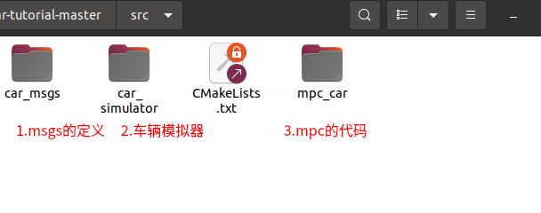
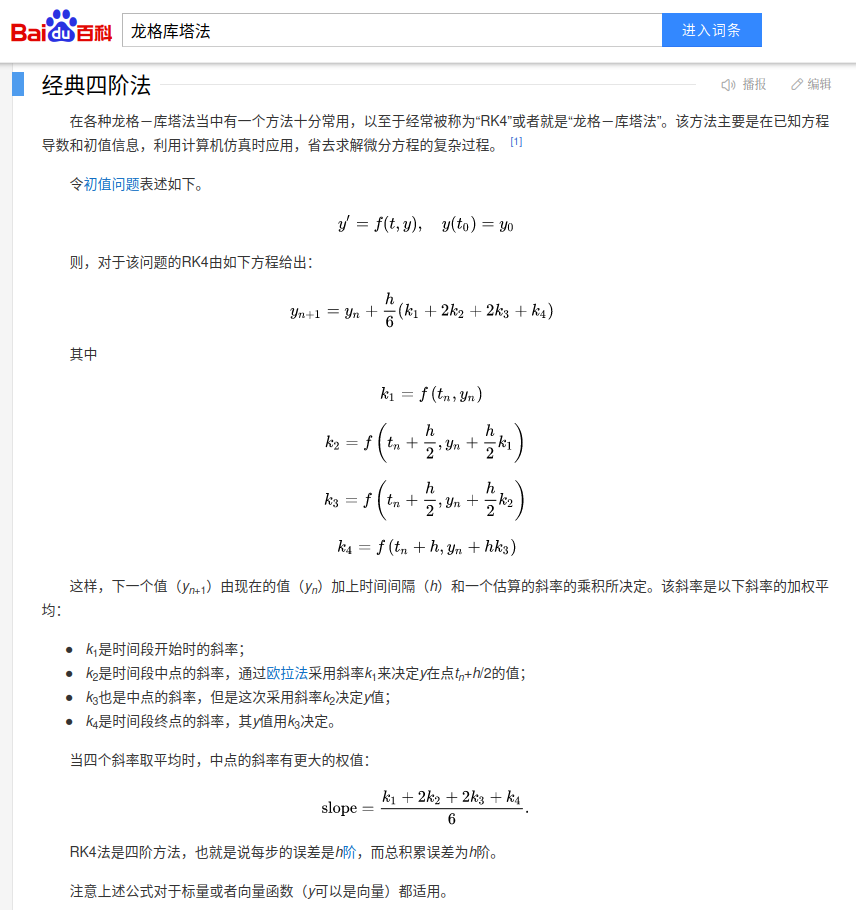

代码结构



car_simulator_nodelet.cpp


mpc_car

配置文件：mpc_car.yaml

mpc_car_nodelet.cpp

onInit()

1.获取yaml配置文件中的参数

2.创建定时器，循环定时运行plan_timer_callback()

3.创建订阅器odom_sub，订阅"odom"话题，里面是（x,y,航向角，速度v）信息

4.创建发布器cmd_pub，发布"car_cmd"话题


mpcPtr->solveNMPC(state)，

mpcPtr->solveQP(state),

mpcPtr->getPredictXU(0, x, u);


先看solveQP:


对于已知初值、导数的表达式和仿真步长，求从初状态到dt时间后的状态，可以用**龙格-库塔法**来求解。可以理解是**斜率的加权平均**。




对应的代码为：

```c++

  inline VectorX diff(const VectorX& state,
                      const VectorU& input) const {
    VectorX ds;
    double phi = state(2);
    double v = state(3);
    double a = input(0);
    double delta = input(1);
    ds(0) = v * cos(phi);
    ds(1) = v * sin(phi);
    ds(2) = v / ll_ * tan(delta);
    ds(3) = a;
    return ds;
  }

  inline void step(VectorX& state, const VectorU& input, const double dt) const {
    // Runge–Kutta
    VectorX k1 = diff(state, input);
    VectorX k2 = diff(state + k1 * dt / 2, input);
    VectorX k3 = diff(state + k2 * dt / 2, input);
    VectorX k4 = diff(state + k3 * dt, input);
    state = state + (k1 + k2 * 2 + k3 * 2 + k4) * dt / 6;
  }
```


